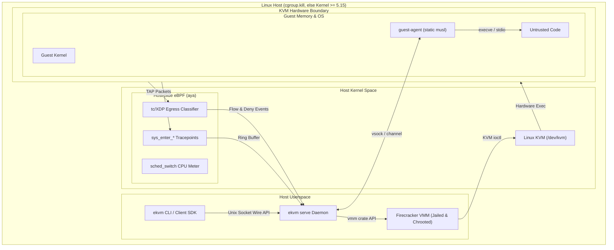
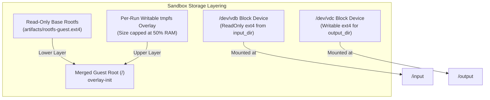

# Host integration

Where the pieces sit, and which boundaries a run crosses:



## Host requirements

- **OS & Kernel**: Linux host with a kernel providing `cgroup.kill`. `ekvm doctor` probes for the primitive rather than trusting a version string, falling back to `>= 5.15` only where there is no cgroup v2 hierarchy to probe.
- **Architecture**: `x86_64` with hardware virtualization extensions (`/dev/kvm`).
- **Permissions**: Root or delegated capabilities (`CAP_SYS_ADMIN`, `CAP_NET_ADMIN`, `CAP_BPF`) for jailing, network namespace management, and eBPF loading.

## Networking

Each sandbox gets its own network namespace, with a tap device (`fc0`) inside it as the guest's
only path out. By default that path leads nowhere (deny-by-default); with `--net` and `--allow`,
host-side eBPF `tc` programs inspect every packet at the tap and enforce the destination
allow-list.

```mermaid
flowchart LR
    subgraph GuestNetns["Per-VM Network Namespace"]
        GuestApp["Untrusted Guest App"]
        Eth0["eth0 (10.200.0.2/30)"]
        Tap["fc0 TAP (10.200.0.1/30)"]
    end

    subgraph HostNet["Host Network Enforcement"]
        TCLink["tc clsact Egress Hook"]
        Map["eBPF BPF_MAP_TYPE_HASH\n(IP / CIDR / Port Allow Rules)"]
        HostInterface["Host Network / Internet"]
        AuditLog["Audit Record (Denial Event)"]
    end

    GuestApp --> Eth0
    Eth0 --> Tap
    Tap --> TCLink
    TCLink -->|Lookup Destination| Map
    Map -->|Match Allowed Rule| HostInterface
    Map -->|No Match (Deny)| AuditLog
```

## Storage

The guest root is a read-only base image (Alpine, with the static `guest-agent` baked in), shared
across sandboxes, with a writable `tmpfs` overlay per run, so nothing a run changes outlives it
unless explicitly collected. Bulk data rides block devices instead: a read-only ext4 built from
`input_dir`, and a writable one extracted after teardown for `output_dir`. Both are embedding-API
fields rather than CLI flags.


