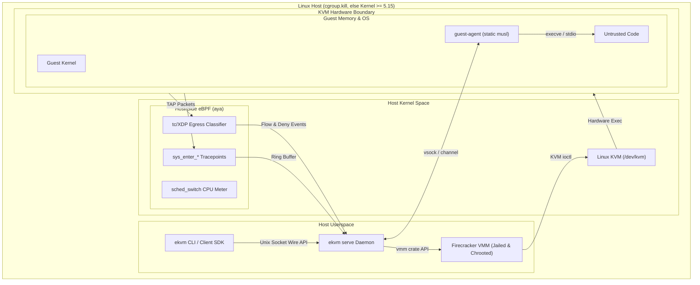
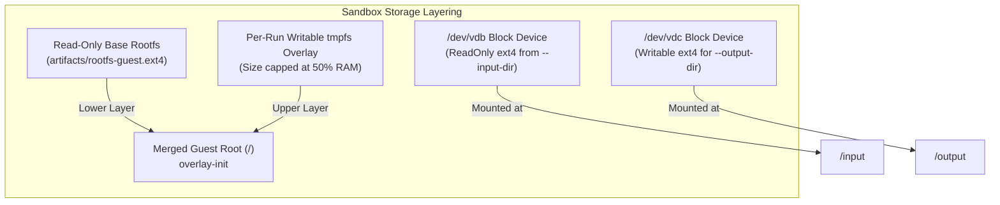

# Architecture and design

The single architecture document: what the engine is and the rules it holds itself to, where the
pieces sit on a host, how the code is laid out and what happens in what order during a run, and the
numbered decisions with the reasoning behind each.

## Scope

### What this is

`eKVM` is a self-hostable, isolated code-execution sandbox engine. Untrusted code runs inside a
**Firecracker** microVM (hardware isolation via Linux KVM). **Host-side eBPF** (`aya`) observes and
enforces what it does, syscalls, network flows, resource accounting, from the host side of the KVM
boundary: the programs are loaded by a host process and attached to host-kernel hooks. The guest
drives four crossings, enumerated in the [threat model](./security-threat-model.md), and none of them names a
BPF program or map.

Every execution yields a host-observed, host-signed **audit log** of execution events. What a
signature does and does not establish is stated in
[Record integrity beyond the guest](./security-threat-model.md#record-integrity-beyond-the-guest).

### Design rules

These are the rules the project holds itself to, stated so a change that breaks one is recognisable
as a design error rather than a trade-off. They describe intent and the mechanism serving it, not a
verified outcome.

1. **Isolation is hardware, not software.** Untrusted code runs in a KVM microVM. A change that
   moves the boundary into guest-side software is a design error, not an optimisation, and a
   shared-kernel shortcut taken to simplify the engine is the same error.
2. **Observe and enforce from the host.** Visibility and policy belong in host-side eBPF, attached
   to host-kernel hooks. The in-guest agent carries exec and IO framing; a change that makes it
   responsible for containing the guest is a design error.
3. **Deny by default.** A sandbox with no explicit policy is configured with no network route out
   and minimal capability, and each allowance is recorded in the audit log.
4. **Engine, not platform.** A self-hostable runtime and a driver API. Tenancy, auth, billing, fleet
   scheduling, and dashboards belong to whoever hosts the engine.
5. **No panic, hang, or leak on the host path.** A hostile or crashing guest, a failed probe, or a
   broken channel should surface as a typed error. This is what the code is written against and what
   the confinement suite exercises; it is an aim, not a proven property.
6. **Measure rather than assert.** Boot, snapshot-restore, memory-sharing, and probe overhead are
   reported as nearest-rank percentiles with the host and date they were taken on. Where a number
   cannot be defended, it is withdrawn rather than published; see [Benchmarks](./benchmarks.md).

## Host integration

Where the pieces sit, and which boundaries a run crosses:



### Host requirements

- **OS & Kernel**: Linux host with a kernel providing `cgroup.kill`. `ekvm doctor` probes for the primitive rather than trusting a version string, falling back to `>= 5.15` only where there is no cgroup v2 hierarchy to probe.
- **Architecture**: `x86_64` with hardware virtualization extensions (`/dev/kvm`).
- **Permissions**: Root or delegated capabilities (`CAP_SYS_ADMIN`, `CAP_NET_ADMIN`, `CAP_BPF`) for jailing, network namespace management, and eBPF loading.

### Networking

Each sandbox gets its own network namespace, with a tap device (`fc0`) inside it as the guest's
only path out. By default that path leads nowhere (deny-by-default); with `--net` and `--allow`,
host-side eBPF `tc` programs inspect every packet at the tap and enforce the destination
allow-list.

```mermaid
flowchart LR
    subgraph GuestNetns["Per-VM Network Namespace"]
        GuestApp["Untrusted Guest App"]
        Eth0["eth0 (10.200.0.2/30)"]
        Tap["fc0 TAP (10.200.0.1/30)"]
    end

    subgraph HostNet["Host Network Enforcement"]
        TCLink["tc clsact Egress Hook"]
        Map["eBPF BPF_MAP_TYPE_HASH\n(IP / CIDR / Port Allow Rules)"]
        HostInterface["Host Network / Internet"]
        AuditLog["Audit Record (Denial Event)"]
    end

    GuestApp --> Eth0
    Eth0 --> Tap
    Tap --> TCLink
    TCLink -->|Lookup Destination| Map
    Map -->|Match Allowed Rule| HostInterface
    Map -->|No Match (Deny)| AuditLog
```

### Storage

The guest root is a read-only base image (Alpine, with the static `guest-agent` baked in), shared
across sandboxes, with a writable `tmpfs` overlay per run, so nothing a run changes outlives it
unless explicitly collected. Bulk data rides block devices instead: a read-only ext4 built from
`--input-dir`, and a writable one extracted after teardown for `--output-dir`.



## Reading the code

This document gives an overview of the implementation: what the crates are for, the types worth
knowing before reading code, and the order things happen in during a run. For finer detail, the code
comments are the authority, and they carry the reasoning this page summarizes.

The reading order that works: this page, then `crates/channel/src/lib.rs` (small, self-contained, and
it defines the host/guest contract), then `crates/vmm/src/vm.rs` and `spawn.rs`, then the eBPF half.

`spawn.rs` keeps the launch, boot, and abort state machine; its separable parts sit alongside it in
`spawn/restore.rs` (the restore path and its disk staging), `spawn/fcversion.rs` (what release is on
this host and what the driver may therefore send it), and `spawn/workdir.rs` (minting the per-VM dir
and the two path constraints on it).

## The `vmm` crate

`vmm` is the engine. It is the crate an embedder depends on, and the only one whose public API
carries the [`api` commit scope](./contributing-development-process.md#the-api-scope).

Its safety posture is the inverse of most VMM projects: **the host path forbids `unsafe` outright**.
`vmm`, `cli`, `channel`, `guest-agent`, and `probes-loader` each carry `#![forbid(unsafe_code)]`, so
that is a compiler error rather than a review convention. `crates/probes` is the single exception,
structurally, because the BPF target requires raw map dereferences. See
[Coding guidelines](./contributing-coding-guidelines.md#use-of-unsafe).

The public surface is deliberately narrow. From `lib.rs`:

```rust
pub use vm::{BootConfig, RunningVm, Snapshot, Vm, DEFAULT_GUEST_CID, VSOCK_PORT};
pub use jail::{Jail, DEFAULT_JAIL_GID, DEFAULT_JAIL_UID, VMM_PIDS_MAX};
pub use lifetime::KillHandle;
pub use net::GuestLink;
pub use pool::Pool;
pub use sweep::{sweep_orphans, SweepReport};
```

Everything else (`console`, `drives`, `exec`, `firecracker`, `jail`'s internals, `paths`, `proc`,
`snapshot`, `spawn`, `sweep`'s internals) is a private module. `doctor` is public because the CLI and
`xtask setup` both render its checks, and it is documented as a diagnostic helper rather than part of
the pinned surface.

## Important concepts

Some types to have in the back of your head before reading further.

* **`Sandbox`** (`lib.rs`) is what an embedder holds. It is a thin wrapper over `RunningVm` whose job
  is to make the right thing the default: `Sandbox::open` **jails unconditionally** (an unset
  `config.jail` becomes `Jail::default()`) and turns the vsock exec channel on, because a `Sandbox`
  exists to run code.

  The opt-out is a *constructor name*, `Sandbox::open_unjailed`, not a boolean flag. That is
  deliberate: a name is greppable and cannot be reached by accident or by a config file, and any
  `jail` set on the config is cleared by it (the name wins). The type is
  `#[must_use = "dropping a Sandbox kills its microVM"]`.

* **`BootConfig`** is the whole boot request: artifact paths, resource knobs, `input_dir`/`output_dir`
  for bulk I/O, networking, the jail. `BootConfig::from_env` applies the
  [layered configuration](./cli-config.md), and the CLI is otherwise a thin translation of flags into
  this struct. If you are adding a boot-time capability, it almost certainly starts here.

* **`RunningVm`** (`vm.rs`) is the booted microVM: the `firecracker` child, its API socket, the scratch
  dir, the captured console, and, importantly, **everything that must be reclaimed**. Its fields are a
  good map of what a VM owns: the active rootfs backing file, the vsock socket, the output device and
  where it extracts to, the per-VM tap (which lives *outside* the workdir, so teardown must delete it
  explicitly), the chroot (whose cgroup is likewise outside), and the lifetime machinery below.

* **`VmLifetime` and `KillHandle`** (`lifetime.rs`) are how a VM dies. `KillHandle` is a cloneable,
  `Send + Sync` handle that force-kills one VM from outside its owning borrow: the host-gave-up path.
  **The kill is the cgroup**, writing `1` to the VM's `cgroup.kill`, which SIGKILLs the whole VMM tree
  with no pid arithmetic, which is why the handle is safe to fire from any thread at any time. On a
  host with no cgroup it falls back to signalling the VMM's pid, which is safe while the VM exists
  because an unreaped child's pid cannot be recycled.

  Note the distinction the code is careful about: **killing is not tearing down.** Host residue is
  still reclaimed by the owner's `Drop` or `shutdown`, which is unblocked by exactly the death the
  handle causes.

* **`VmmError` and `ErrorKind`** (`lib.rs`) are the typed-error contract. `VmmError` is
  `#[non_exhaustive]` and its `kind()` maps every variant into one of three buckets an embedder can
  branch on: `Infra` (retry or fix the host), `Transport` (retire this VM), `Guest` (surface to the
  user). **The match in `kind()` is deliberately wildcard-free**, so adding a variant fails to compile
  until someone gives it a deliberate bucket. That is the mechanism keeping the contract honest.

* **`SandboxProbes` and `RunRecord`** (`probes-loader`) are the observation half: the attach bundle for
  one sandbox, and the record it finalizes. See [the eBPF half](#the-ebpf-half) below.

## Booting a sandbox

`Vm::boot` is the entry point. `Sandbox::open` is a thin wrapper over it. The sequence, in order:

**1. Refuse-first preflight.** Three checks run before anything is touched, each returning a typed
error that names its own fix:

- `refuse_uncappable_boot`, for a `require_limits` boot that cannot be capped, because caps live on the
  jailed VMM's cgroup and an unjailed run is definitionally uncapped.
- `refuse_unusable_scratch`, for a jailed boot whose scratch dir sits on a `nodev` or `noexec` mount,
  since the jailer's chroot needs a working `/dev/kvm` node and an executable `firecracker` copy there.
- `refuse_unsupported_vcpus`, for a count the pinned VMM will reject.

The pattern is worth internalizing, because it recurs: **find out early and say so**, rather than
spawning a VMM and letting a raw Firecracker error surface deep in boot. Each of these exists because
the deep-in-boot version of the failure was confusing enough to be mistaken for an engine bug.

**2. The KVM check**, done here rather than inside `launch`, so the launch and boot-failure machinery
stays unit-testable on hosts without KVM (a fake `firecracker` needs no VM).

**3. One deadline for the whole boot.** `boot_deadline` is computed once and shared by host-side
staging and the API boot, so a slow rootfs copy cannot run unbounded before the boot's own timeout
even starts.

**4. `Spawned::launch`** does the host-side staging, all of it under that deadline:

- `create_workdir` (in `spawn/workdir.rs`) mints `<scratch>/ekvm-<pid>-<seq>` **fail-if-exists at mode 0700**, advancing the
  sequence on collision. Both properties matter: the scratch base is world-writable and the name is
  predictable, so a pre-existing directory must never be adopted. The name is also deliberately
  *short*, because the jailer nests it **twice** inside the API socket path, which must fit
  `sockaddr_un.sun_path` at roughly 108 bytes.
- The workdir is immediately wrapped in a `WorkdirGuard`, whose `Drop` removes it on every exit from
  the staging window, an error return or an unwinding panic alike. It is disarmed only once a tap may
  exist, from which point the netns-aware reclaim helpers own cleanup instead.
- The rootfs is either **shared** (a `read_only_root` boot hands Firecracker the pinned base `O_RDONLY`
  and the guest's writable layer comes from its tmpfs overlay) or **copied** per VM. The copy is the
  heaviest host-side step, so the deadline is checked before it and re-checked by each later step.
- Bulk `input_dir` and `output_dir` become ext4 images in the workdir, attached as extra block devices.
- Networking, when asked for, is a per-VM netns holding a tap.
- The jailer is spawned (not `firecracker` directly) and stages resources into its chroot.

**5. `run_boot`** drives the Firecracker API socket through the boot sequence and waits for the guest's
readiness marker on the console. That marker is configurable, because it is a property of the rootfs
image rather than of the engine.

**6. The probes attach after boot**, not before. See below for why that ordering is a deliberate trade.

## Executing a command

Exec rides `crates/channel` over vsock. The protocol is deliberately dull: a 5-byte header (a tag plus
a little-endian `u32` length) and then a payload, with **the length checked against `MAX_PAYLOAD`
(1 MiB) before anything is allocated**. That ordering is the whole defense against a hostile guest
declaring a 4 GiB frame.

`channel` has **no dependencies at all**, and is shared verbatim by the driver and the in-guest agent,
so the two sides cannot drift on the wire format.

Inside the guest, `guest-agent` runs one command per connection and streams stdout, stderr, and the
exit status back as frames. It is built static against musl and baked into the rootfs. It is
**exec and I/O convenience, not a security boundary**: a guest that compromises it has compromised
something the threat model already assumes is hostile.

Three bounds apply to every exec, and each exists because a hostile guest can otherwise grow host cost
without limit:

- A **wall-clock budget**, so a command that never exits becomes a typed timeout.
- An **aggregate output cap** (16 MiB by default). Each frame is already bounded by `MAX_PAYLOAD`, but
  a guest can send unboundedly *many* frames, so the total is capped too. Per-frame overhead is charged
  toward the cap as well, so a flood of empty frames cannot spin the collect loop for free.
- A **vsock connect and handshake deadline**, so a dead or stalled guest is a typed error rather than a
  host hang. Liveness is the transport's job.

## Teardown, and the paths you do not call

This is the subtle part of the codebase, and the part most worth reading carefully. Design rule 5 says
a hostile or crashing guest should surface as a typed error rather than a panic, hang, or leak, and
most of the machinery here exists to hold up the "leak" half under conditions where ordinary `Drop` is
not enough.

There are four layers, each covering a failure the previous one cannot:

**`Drop` on `RunningVm`** handles the ordinary path, including an early `?` return or an unwinding
panic. It reclaims the VMM, the workdir, and the out-of-workdir residue (the tap, the jailer's cgroup)
that the workdir removal would otherwise miss.

**The sentinel** covers losing the whole driver process, where no destructor runs at all: Ctrl-C,
SIGKILL, an OOM kill. It is a small POSIX `sh` process holding the read end of a pipe. The kernel
closes the write end when the driver dies **on any exit path**, so `read` returning EOF *is* the death
notification: no polling, no signal handlers, no timers. It runs `trap ''` first, so a SIGINT racing
the new process group cannot kill the sentinel before it does its job, and everything after the `read`
is best-effort and idempotent, so on a clean teardown it finds the directories already gone and falls
through instantly. Teardown waits a bounded time for a disarmed sentinel and then hard-kills it,
because the driver must never hang waiting on its own cleanup helper.

**`cgroup.kill`** is what makes the kill itself atomic and complete: one write takes down the entire
VMM process tree without enumerating pids, which is why it is also the capability
[`ekvm doctor` probes for](./cli-commands.md#ekvm-doctor) rather than inferring from a kernel version.

**The orphan sweep** (`sweep.rs`, public as `sweep_orphans`) is the backstop for residue that outlived
everything above, from a driver killed in a way that defeated even the sentinel. It scans the scratch
base for `ekvm-<pid>-<seq>` directories whose owning pid is gone, detaches any mounts underneath (a
leaked bind mount would otherwise make removal fail with `EBUSY` and silently poison later mountinfo
scans), and reclaims them.

Two smaller guards follow the same shape: `StagedDisk` for the restore path's out-of-workdir disk copy,
and `ensure_private_staging_dir`, which refuses to adopt a staging directory that is not owned by us at
mode 0700, because a snapshot bakes in a predictable path that a local attacker could pre-create.

The confinement suite (`crates/vmm/tests/confinement.rs`) is where these are exercised:
`driver_death_cannot_leak_a_vm`, `a_jailed_vmm_killed_mid_boot_leaves_no_mounts_behind`,
`sweep_reclaims_a_crashed_drivers_netns_and_scratch_dir`.

## The eBPF half

Three crates, split by what can depend on what:

- **`probes`** is the eBPF programs themselves: `#![no_std]`, built for `bpfel-unknown-none` via
  `bpf-linker`, using CO-RE and BTF so one object loads across kernel versions. Syscall tracepoints, a
  tc/XDP classifier on the VM's tap, and cgroup accounting.
- **`probes-common`** holds the `#[repr(C)]` plain-old-data records that cross the kernel/user
  boundary. **Zero dependencies, single-sourced**, so the program writing a record and the loader
  reading it cannot disagree about layout.
- **`probes-loader`** is the userspace half, on `aya`: attach to a specific sandbox, read the maps,
  fold events, and assemble the signed `RunRecord`.

`probes-loader` is one module per subsystem, which is the map to read it by:

| Module | What it owns |
|---|---|
| `tracer.rs` | `ExecveCounter`, `SyscallTracer`: the syscall tracepoints |
| `tap.rs` | `TapMonitor`, `NetStats`: the tc classifiers, the flow and denial maps, the netns join |
| `egress.rs` | `EgressPolicy`, `Ipv4Cidr`, `Ipv6Cidr`: **no eBPF**, just what an `--allow` string parses into, separately fuzzed |
| `meter.rs` | `ResourceMeter`, `CgroupStats`: the shared CPU meter and cgroup counters |
| `observer.rs` | the per-sandbox bundle over the three probes, and the `AxisGap` machinery |
| `record.rs`, `summary.rs`, `json.rs`, `signing.rs` | the record, its projections, and its signature |
| `lib.rs` | the error types, object-path resolution, cgroup id helpers, the capability check |

Three design decisions in `observer.rs` are worth understanding before changing anything there:

**The syscall tracer and CPU meter are host-global, not per-VM.** A fresh copy per sandbox would run
*N* programs on every context switch and every syscall, which is O(sandboxes) on the hottest path in
the kernel. Instead each is loaded **once** for the host, and every sandbox registers its cgroup as a
*target*, so per-event cost stays a single hash lookup no matter how many sandboxes are live. The tap
monitor is legitimately per-VM, since there is one tap per sandbox.

**One post-boot attach.** Because the shared probes are already attached and a sandbox only registers
its cgroup, which exists once the jailer creates it, there is no per-VM program to stand up before
boot. The trade is explicit: the syscall axis observes from *registration* onward, not the pre-boot
window. The record's core (network, resources, denials) is unaffected.

**Observation fails open; enforcement does not.** Every axis degrades independently to a recorded
`AxisGap`, so a host without BTF or `CAP_BPF` still runs the sandbox and produces a thinner record that
*says* it is thinner. The invariant to preserve when touching this code is that a lost fold or a
poisoned lock is a **recorded gap, never an empty footprint passed off as a quiet run**. Egress
enforcement is the opposite: `--allow` on a host that cannot load the probes is a typed refusal, since
silently not enforcing a security control is the worst available outcome.

Finalized records are signed with an `ed25519` host key the guest never sees, and within a session each
record commits to the previous one's hash, so a *sequence* is tamper-evident and not just a single
record. What that does and does not establish is in
[the threat model](./security-threat-model.md#record-integrity-beyond-the-guest).

## Snapshots and the pool

`snapshot.rs` creates and restores Firecracker snapshots; `pool.rs` keeps pre-warmed clones so an
`open` can be served by a restore rather than a cold boot. A restore runs the **same** preflight guards
as a boot, which is why `refuse_unusable_scratch` is called from both.

Two constraints fall out of the design and are enforced rather than documented: a VM produced by
`restore` refuses to be re-snapshotted (its live disk is an anonymous inode with no host path), and a VM
with a bulk input device refuses to be snapshotted at all, because the snapshot would bake in a scratch
path that will not exist after teardown.

## The daemon

`ekvm serve` is the same engine behind a versioned newline-JSON protocol on a unix socket. `protocol`
holds the wire types, `client` is a dependency-light reference client, and `cli`'s `serve.rs` and
`session.rs` are the server.

The security-relevant difference from the CLI: a daemon's clients control neither its config file nor
its environment, so it takes its resource ceilings as **explicit flags** rather than from a discovered
`.ekvm.toml`. A daemon must not read a security control out of whatever directory it happened to be
started in.

## Index of crates

| Crate | Role |
|---|---|
| `vmm` | The engine and the embedder-facing API. The Firecracker driver, the jail, networking, snapshots, the pool, and every teardown path. |
| `channel` | The host/guest wire protocol. Dependency-free framing, shared verbatim by driver and agent. |
| `guest-agent` | The in-guest agent. One command per connection, static musl, baked into the rootfs. Not a security boundary. |
| `probes` | The eBPF programs. `no_std`, built for `bpfel-unknown-none`, the one crate allowed `unsafe`. |
| `probes-common` | The `#[repr(C)]` records crossing the eBPF boundary. Zero dependencies, single-sourced. |
| `probes-loader` | The aya userspace half: attach, fold, assemble the record, sign it. |
| `protocol` | The daemon's wire types, versioned. |
| `client` | The Rust reference client for `ekvm serve`. |
| `cli` | The `ekvm` binary: `run`, `shell`, `doctor`, `verify`, and the `serve` daemon. Package name `ekvm`, directory `cli`. |
| `test-support` | Test fixtures: scratch dirs, small filesystems for disk-full cases, cgroup helpers, the real-root guard. |
| `xtask` | Dev orchestration: the gates, artifact builds, benchmarks, packaging. Never shipped. |

## Key architectural decisions

### 1. Hardware isolation over software containers
Untrusted code goes inside a Firecracker microVM backed by KVM rather than a shared-kernel sandbox.
The guest runs against its own kernel, so a guest kernel panic or compromise is contained by the
CPU's virtualization boundary rather than by host-side software. That boundary is KVM's to enforce;
the [threat model](./security-threat-model.md#assumptions-and-residual-risk) lists it as an assumption this
project depends on rather than a property it establishes.

### 2. Host-side eBPF observability & policy
An in-guest monitoring agent falls with the guest. Security-relevant observation and enforcement
therefore live in host-side eBPF: tracepoints and `tc` classifiers loaded by a host process and
attached to host-kernel hooks, outside the guest's address space and outside any namespace the guest
can enter.

### 3. Jailed execution by default
Firecracker instances are launched via the `jailer` helper, which places the process inside a restricted chroot, drops privileges to an unprivileged user/group, applies seccomp filters, and assigns cgroup v2 limits before executing guest code.

### 4. Ephemeral sandbox sessions & snapshots
Each execution session maps to its own microVM instance. Pre-warmed pools and snapshot restore
shorten start-up by reusing a snapshot rather than by sharing a VM between runs, so each run still
gets its own instance. Latency figures are withdrawn pending a re-measurement on a verified host;
see [Benchmarks](./benchmarks.md).

### 5. Host-signed audit records
Audit records captured by `probes-loader` carry the VMM's host-side syscall footprint, the guest's network flows, and its resource usage for a run. The host signs each finalized record with a host-held ed25519 key, so alteration after the run is detectable off-host (`ekvm verify`).

### 6. Versioned newline-JSON daemon protocol
The `ekvm serve` daemon uses a versioned newline-delimited JSON wire protocol over a Unix socket. This isolates client applications from Rust engine internals; polyglot SDKs drive the wire, not the crate.

### 7. Synchronous engine, no async runtime
The driver and the daemon are **synchronous**: blocking I/O, one thread per session, no `tokio` or
other executor anywhere in `vmm`, `channel`, or `ekvm serve`. This is a decision, not an accident of
how the code grew, and it rests on three arguments.

**Concurrency here is bounded by microVMs, not by sockets.** A session's real cost
is a whole Firecracker microVM holding hundreds of MiB of guest RAM, so the daemon's ceiling
(`--max-sessions`, default 16, plus the committed-memory ceilings) is reached by host RAM long
before thread stacks are worth a thought. Thread-per-session at this scale is free, and it keeps a
stack trace readable end to end.

**The dependency surface is a security property.** This engine's pitch is that a hoster can audit
what runs untrusted code. `vmm` is `#![forbid(unsafe_code)]` with a deliberately small dependency
graph gated by `cargo deny`; pulling an executor and its ecosystem into that crate would enlarge
the supply-chain surface of exactly the component whose minimalism is the point.

**Async swaps the bug catalog rather than emptying it.** Timing bugs come from concurrency, which
this engine has either way. Going async trades abandoned threads and blocking-call hazards for
cancellation-safety bugs, untracked `tokio::spawn` tasks (the same leak shape, one level up), and
executor starvation, which are materially harder to observe than a thread count in `/proc` (the
axis the boot soak's leak assertions actually watch). Bounding a blocking call needs care, not a
runtime: `connect_with_timeout` does it with a non-blocking socket and a deadline, no thread and
no executor.

**What would change this decision.** Stated so the trade-off can be re-opened on evidence rather
than on taste:

- A credible need for hundreds to thousands of concurrent **idle** sessions (parked connections,
  not running VMs), where per-thread stacks become the binding constraint.
- Genuinely multiplexed daemon work: streaming exec output to many concurrent watchers, long-lived
  event subscriptions, or a network-facing (rather than local-socket) protocol.
- A profile showing thread-per-session as a **measured** bottleneck under realistic workloads.

None of these are planned, so the engine stays synchronous.

**This does not constrain downstream.** Async is the right choice in plenty of places that consume
this engine, and the architecture keeps them outside this repo: the polyglot SDKs (a Python SDK
should ship an `async` variant, since the agent frameworks calling it are async) and any hoster's
platform layer multiplexing many daemons. They speak the wire protocol, which is transport-agnostic
and says nothing about how either side schedules its work.

### 8. Portability is a capability question, not a distro question

The engine targets **Linux kernels, not Linux distributions**. Nothing in this repo reads
`/etc/os-release`, branches on a distro name, or carries a per-distro code path. When a host
difference matters, the engine asks the kernel what it can *do* and reports the answer.

The worked example is the host-kernel floor. It began as `>= 5.15`, a version number standing in for
"a security-maintained LTS". That proxy fails on enterprise kernels: RHEL 9 ships `5.14.0-*.el9` and
Red Hat backports security fixes to it for a decade, so a version test refuses a patched, supported
kernel for no safety gain. `ekvm doctor` now probes for `cgroup.kill` (the crash-safe teardown
primitive `lifetime.rs` needs, kernel 5.14+) and keeps the version only as a fallback for hosts with
no cgroup v2 hierarchy to probe. Same argument as the Firecracker floor in
[Firecracker version policy](./contributing-firecracker-policy.md#a-new-api-field-may-not-raise-the-floor): reject *unpatched*, not
*old*.

Three properties follow, and they are the reason this is a rule rather than a preference:

- **A capability probe is bounded; a distro list is not.** Rocky, Alma, CentOS Stream, Oracle Linux,
  and Amazon Linux are all RHEL, and each distro varies again by point release. The set of things
  the engine actually needs is short and stable.
- **A capability probe is testable without the host.** `cgroup_kill_under` and `mac_posture` take a
  path, so their tests construct the shapes an enterprise kernel presents on a laptop that has never
  seen one. A distro branch can only be tested on that distro.
- **The variance stays in preflight.** `doctor.rs` absorbs host differences and either passes or
  refuses with a named fix; `spawn.rs` and `jail.rs` stay uniform. A conditional in the boot path
  would create N boot paths and leave N-1 of them untested.

The same rule decides how the engine is *shipped*. A glibc-linked binary carries the build host's
symbol versions, and glibc is backward but not forward compatible, so a package built on the newest
CI runner fails to start on an older host before reaching `main()`. `cargo xtask dist` therefore
builds the shipped binary static against musl and calls `verify_static` on the result, so the
package depends on no host libc at all. Dev builds stay native.

**What this does not claim.** Probing a capability says nothing about whether the kernel is
*patched*, which is the operator's to know and is stated as such in the check's own note. Nor is it
a portability claim: see [what has not been done](./introduction.md#what-has-not-been-done) for which hosts have actually been run, which as of
this writing does not include any Red Hat host.
