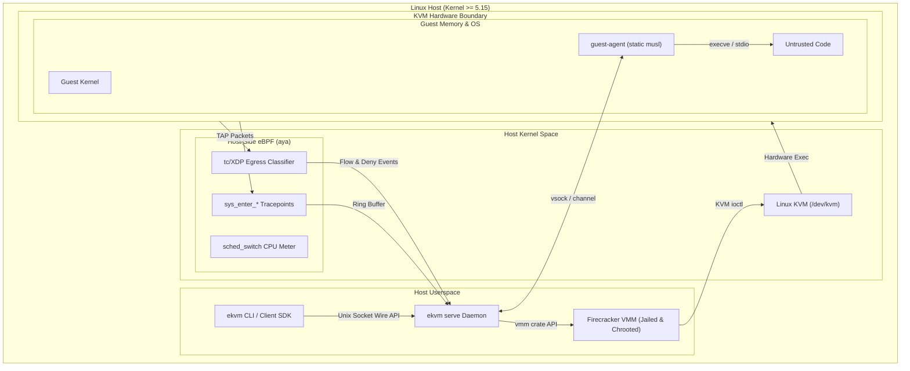
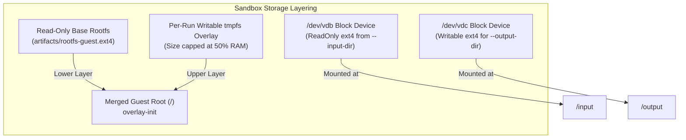

# eKVM Architecture and Design

## Scope

### What is eKVM

`eKVM` is a self-hostable, isolated code-execution sandbox engine. Untrusted code runs inside a **Firecracker** microVM (hardware isolation via Linux KVM); **host-side eBPF** (`aya`) observes and enforces what it does—syscalls, network flows, resource accounting—from *outside* the guest, where untrusted code cannot see or subvert it.

Every execution yields a tamper-resistant, host-observed, host-signed **audit log** of execution events.

### Core Properties

1. **Isolation is hardware, not software.** Untrusted code runs in a KVM microVM; the security boundary is hardware (CPU/KVM), not guest-side software.
2. **Observe & enforce from the host.** Visibility and policy live in host-side eBPF that the guest cannot reach. In-guest agents exist for convenience (exec/IO framing), never for security.
3. **Engine, not platform.** A self-hostable runtime + a clean driver API. Multi-tenancy auth, billing, fleet scheduling, and dashboards belong to the hoster.
4. **Measured, not marketed.** Boot, snapshot-restore, memory-sharing, and eBPF overhead are benchmarked with empirical percentiles.

### Features

- **Hardware Confinement**: MicroVMs run constrained under Linux KVM, jailed via chroot, unprivileged user namespaces, seccomp filters, and cgroup v2 resource limits.
- **Host-Side Observability**: Host-side eBPF programs trace guest syscalls, monitor network flows, and meter CPU usage from the host kernel.
- **Egress Policy Enforcement**: Network egress is deny-by-default; eBPF `tc` filters enforce explicit IP/CIDR/port allow-lists at the virtual TAP interface.
- **Tamper-Evident Audit Logging**: Execution events are serialized into deterministic JSON records and host-signed using a host-only key.
- **Versioned Wire Protocol**: The `ekvm serve` daemon exposes a versioned newline-delimited JSON API over a Unix domain socket, allowing polyglot clients to drive sandboxes without linking engine internals.

---

## Host Integration

The following diagram illustrates how eKVM integrates hardware isolation, host-side eBPF probes, and containerization barriers:



### Host Requirements

- **OS & Kernel**: Linux host with kernel `>= 5.15` (enforcing `cgroup.kill` and security-maintained LTS APIs).
- **Architecture**: `x86_64` with hardware virtualization extensions (`/dev/kvm`).
- **Permissions**: Root or delegated capabilities (`CAP_SYS_ADMIN`, `CAP_NET_ADMIN`, `CAP_BPF`) for jailing, network namespace management, and eBPF loading.

### Host Networking Integration

- Each sandbox runs inside a dedicated, isolated **per-VM network namespace** (`netns`).
- Communication with the host uses a virtual TAP device (`fc0`) allocated inside the sandbox netns.
- By default, guest networking has no route to the outside world (deny-by-default). When configured with `--net` and `--allow`, host-side eBPF `tc` programs inspect every packet at the TAP interface and enforce destination allow-lists.

```mermaid
flowchart LR
    subgraph GuestNetns["Per-VM Network Namespace"]
        GuestApp["Untrusted Guest App"]
        Eth0["eth0 (10.200.0.2/30)"]
        Tap["fc0 TAP (10.200.0.1/30)"]
    end

    subgraph HostNet["Host Network Enforcement"]
        TCLink["tc clsact Egress Hook"]
        Map["eBPF BPF_MAP_TYPE_HASH\n(IP / CIDR / Port Allow Rules)"]
        HostInterface["Host Network / Internet"]
        AuditLog["Audit Record (Denial Event)"]
    end

    GuestApp --> Eth0
    Eth0 --> Tap
    Tap --> TCLink
    TCLink -->|Lookup Destination| Map
    Map -->|Match Allowed Rule| HostInterface
    Map -->|No Match (Deny)| AuditLog
```

### Storage Architecture

- **Root Filesystem**: A read-only base image (Alpine Linux base with pre-installed static `guest-agent`) shared across sandboxes.
- **Per-Run Overlay**: A `tmpfs` writable overlay per execution, ensuring state changes do not persist across sandbox runs unless explicitly saved.
- **Bulk Input/Output**: Optional read-only ext4 block devices for large input payloads (`--input-dir`) and writable ext4 block devices for output extraction (`--output-dir`).



---

## Internal Architecture

### Repo Layout and Core Components

The codebase is organized as a single Cargo workspace split along isolation, observability, and driver boundaries:

- `crates/vmm`: The Firecracker VMM driver. Manages microVM lifecycles (boot, exec, shutdown), rootfs/TAP networking setup, snapshots, pre-warmed VM pools, jailer/cgroup confinement, and the public `Sandbox` API.
- `crates/channel`: Host↔guest wire framing protocol over stream sockets (`vsock` / Unix sockets). Dependency-free, `no_std`-compatible framing with zeroize memory hygiene.
- `crates/guest-agent`: Statically linked in-guest binary (`guest-agent`) compiled for `x86_64-unknown-linux-musl`. Executes commands inside the guest and streams `stdout`, `stderr`, and exit codes over `channel`.
- `crates/probes`: eBPF programs (`bpfel-unknown-none`) compiled via `bpf-linker`. Contains raw kernel tracepoint handlers, `tc` egress policy enforcers, and cgroup accounting hooks.
- `crates/probes-common`: Zero-dependency, `#![no_std]` `#[repr(C)]` POD struct definitions shared between eBPF kernel programs and userspace loaders.
- `crates/probes-loader`: Userspace loader built on `aya`. Responsible for loading eBPF ELF objects into the host kernel, attaching tracepoints/tc filters to sandboxes, reading ring buffers, and streaming audit events.
- `crates/cli`: The primary user-facing binary (`ekvm`). Implements CLI subcommands (`run`, `shell`, `doctor`, `inspect`) and the `ekvm serve` daemon.
- `xtask`: Developer automation tool. Runs host-safe CI checks (`cargo xtask ci`), privileged VM integration tests (`ci-privileged`), rootfs/kernel builds, and self-hosting vendoring routines.

---

## Key Architectural Decisions

### 1. Hardware Isolation over Software Containers
Software sandboxes (e.g., container runtimes, seccomp-only filters) share the host Linux kernel surface with untrusted code. eKVM enforces hardware isolation by placing untrusted code inside a Firecracker microVM backed by KVM. A guest kernel panic or compromise cannot compromise the host kernel.

### 2. Host-Side eBPF Observability & Policy
In-guest monitoring agents can be subverted if the guest kernel or root account is compromised. eKVM places all security observability and enforcement in host-side eBPF tracepoints and `tc` classifiers attached from the host kernel, out of reach of guest code.

### 3. Jailed Execution by Default
Firecracker instances are launched via the `jailer` helper, which places the process inside a restricted chroot, drops privileges to an unprivileged user/group, applies seccomp filters, and assigns cgroup v2 limits before executing guest code.

### 4. Ephemeral Sandbox Sessions & Snapshots
Each execution session maps to an isolated microVM instance. Pre-warmed microVM pools and snapshot restore mechanics allow sub-millisecond execution start times without sacrificing per-run isolation guarantees.

### 5. Host-Signed Audit Records
Audit logs captured by `probes-loader` record all syscalls, network flows, and resource usage during a sandbox run. To prevent off-host tampering or forgery, the host signs finalized audit records with a host-held ed25519 key, enabling external verification (`ekvm verify --key <key_id>`) of execution integrity.

### 6. Versioned Newline-JSON Daemon Protocol
The `ekvm serve` daemon uses a versioned newline-delimited JSON wire protocol over a Unix socket. This isolates client applications from Rust engine internals and allows polyglot SDKs to control eKVM instances cleanly.

### 7. Synchronous Engine, No Async Runtime
The driver and the daemon are **synchronous**: blocking I/O, one thread per session, no `tokio` or
other executor anywhere in `vmm`, `channel`, or `ekvm serve`. This is a decision, not an accident of
how the code grew, and it rests on three arguments.

**Concurrency here is bounded by microVMs, not by sockets.** An async runtime earns its complexity
when a process multiplexes many thousands of cheap, mostly-idle connections. A session's real cost
is a whole Firecracker microVM holding hundreds of MiB of guest RAM, so the daemon's ceiling
(`--max-sessions`, default 16, plus the committed-memory ceilings) is reached by host RAM long
before thread stacks are worth a thought. Thread-per-session at this scale is free, and it keeps a
stack trace readable end to end.

**The dependency surface is a security property.** This engine's pitch is that a hoster can audit
what runs untrusted code. `vmm` is `#![forbid(unsafe_code)]` with a deliberately small dependency
graph gated by `cargo deny`; pulling an executor and its ecosystem into that crate would enlarge
the supply-chain surface of exactly the component whose minimalism is the point.

**Async swaps the bug catalog rather than emptying it.** Timing bugs come from concurrency, which
this engine has either way. Going async trades abandoned threads and blocking-call hazards for
cancellation-safety bugs, untracked `tokio::spawn` tasks (the same leak shape, one level up), and
executor starvation, which are materially harder to observe than a thread count in `/proc` (the
axis the boot soak's leak assertions actually watch). Bounding a blocking call needs care, not a
runtime: `connect_with_timeout` does it with a non-blocking socket and a deadline, no thread and
no executor.

**What would change this decision.** Stated so the trade-off can be re-opened on evidence rather
than on taste:

- A credible need for hundreds to thousands of concurrent **idle** sessions (parked connections,
  not running VMs), where per-thread stacks become the binding constraint.
- Genuinely multiplexed daemon work: streaming exec output to many concurrent watchers, long-lived
  event subscriptions, or a network-facing (rather than local-socket) protocol.
- A profile showing thread-per-session as a **measured** bottleneck, per the measured-not-marketed
  guardrail.

None of these are on the roadmap, so the engine stays synchronous for the foreseeable future.

**This does not constrain downstream.** Async is the right choice in plenty of places that consume
this engine, and the architecture keeps them outside this repo: the polyglot SDKs (a Python SDK
should ship an `async` variant, since the agent frameworks calling it are async) and any hoster's
platform layer multiplexing many daemons. They speak the wire protocol, which is transport-agnostic
and says nothing about how either side schedules its work.
