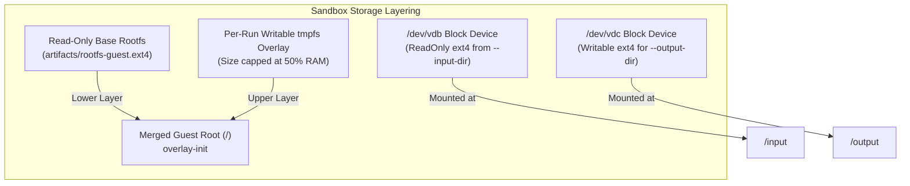

# Architecture and design

## Scope

### What this is

`eKVM` is a self-hostable, isolated code-execution sandbox engine. Untrusted code runs inside a
**Firecracker** microVM (hardware isolation via Linux KVM). **Host-side eBPF** (`aya`) observes and
enforces what it does, syscalls, network flows, resource accounting, from the host side of the KVM
boundary: the programs are loaded by a host process and attached to host-kernel hooks. The guest
drives four crossings, enumerated in the [threat model](./security-threat-model.md), and none of them names a
BPF program or map.

Every execution yields a host-observed, host-signed **audit log** of execution events. What a
signature does and does not establish is stated in
[Record integrity beyond the guest](./security-threat-model.md#record-integrity-beyond-the-guest).

### Design rules

These are the rules the project holds itself to, stated so a change that breaks one is recognisable
as a design error rather than a trade-off. They describe intent and the mechanism serving it, not a
verified outcome.

1. **Isolation is hardware, not software.** Untrusted code runs in a KVM microVM. A change that
   moves the boundary into guest-side software is a design error, not an optimisation, and a
   shared-kernel shortcut taken to simplify the engine is the same error.
2. **Observe and enforce from the host.** Visibility and policy belong in host-side eBPF, attached
   to host-kernel hooks. The in-guest agent carries exec and IO framing; a change that makes it
   responsible for containing the guest is a design error.
3. **Deny by default.** A sandbox with no explicit policy is configured with no network route out
   and minimal capability, and each allowance is recorded in the audit log.
4. **Engine, not platform.** A self-hostable runtime and a driver API. Tenancy, auth, billing, fleet
   scheduling, and dashboards belong to whoever hosts the engine.
5. **No panic, hang, or leak on the host path.** A hostile or crashing guest, a failed probe, or a
   broken channel should surface as a typed error. This is what the code is written against and what
   the confinement suite exercises; it is an aim, not a proven property.
6. **Measure rather than assert.** Boot, snapshot-restore, memory-sharing, and probe overhead are
   reported as nearest-rank percentiles with the host and date they were taken on. Where a number
   cannot be defended, it is withdrawn rather than published; see [Benchmarks](./benchmarks.md).

## Host integration

Where the pieces sit, and which boundaries a run crosses:


### Host requirements

- **OS & Kernel**: Linux host with a kernel providing `cgroup.kill`. `ekvm doctor` probes for the primitive rather than trusting a version string, falling back to `>= 5.15` only where there is no cgroup v2 hierarchy to probe.
- **Architecture**: `x86_64` with hardware virtualization extensions (`/dev/kvm`).
- **Permissions**: Root or delegated capabilities (`CAP_SYS_ADMIN`, `CAP_NET_ADMIN`, `CAP_BPF`) for jailing, network namespace management, and eBPF loading.

### Networking

Each sandbox gets its own network namespace, with a tap device (`fc0`) inside it as the guest's
only path out. By default that path leads nowhere (deny-by-default); with `--net` and `--allow`,
host-side eBPF `tc` programs inspect every packet at the tap and enforce the destination
allow-list.

```mermaid
flowchart LR
    subgraph GuestNetns["Per-VM Network Namespace"]
        GuestApp["Untrusted Guest App"]
        Eth0["eth0 (10.200.0.2/30)"]
        Tap["fc0 TAP (10.200.0.1/30)"]
    end

    subgraph HostNet["Host Network Enforcement"]
        TCLink["tc clsact Egress Hook"]
        Map["eBPF BPF_MAP_TYPE_HASH\n(IP / CIDR / Port Allow Rules)"]
        HostInterface["Host Network / Internet"]
        AuditLog["Audit Record (Denial Event)"]
    end

    GuestApp --> Eth0
    Eth0 --> Tap
    Tap --> TCLink
    TCLink -->|Lookup Destination| Map
    Map -->|Match Allowed Rule| HostInterface
    Map -->|No Match (Deny)| AuditLog
```

### Storage

The guest root is a read-only base image (Alpine, with the static `guest-agent` baked in), shared
across sandboxes, with a writable `tmpfs` overlay per run, so nothing a run changes outlives it
unless explicitly collected. Bulk data rides block devices instead: a read-only ext4 built from
`--input-dir`, and a writable one extracted after teardown for `--output-dir`.



---

## Internal architecture

### Repo layout

One Cargo workspace, split along the isolation/observability/driver boundaries:

- `crates/vmm`: The Firecracker VMM driver. Manages microVM lifecycles (boot, exec, shutdown), rootfs/TAP networking setup, snapshots, pre-warmed VM pools, jailer/cgroup confinement, and the public `Sandbox` API.
- `crates/channel`: Host↔guest wire framing protocol over stream sockets (`vsock` / Unix sockets). Dependency-free, `no_std`-compatible framing with zeroize memory hygiene.
- `crates/guest-agent`: Statically linked in-guest binary (`guest-agent`) compiled for `x86_64-unknown-linux-musl`. Executes commands inside the guest and streams `stdout`, `stderr`, and exit codes over `channel`.
- `crates/probes`: eBPF programs (`bpfel-unknown-none`) compiled via `bpf-linker`. Contains raw kernel tracepoint handlers, `tc` egress policy enforcers, and cgroup accounting hooks.
- `crates/probes-common`: Zero-dependency, `#![no_std]` `#[repr(C)]` POD struct definitions shared between eBPF kernel programs and userspace loaders.
- `crates/probes-loader`: the userspace loader, built on `aya`: load the eBPF objects, attach tracepoints/tc filters to a sandbox, read the maps, stream audit events.
- `crates/cli`: the `ekvm` binary: `run`, `shell`, `doctor`, `verify`, and the `ekvm serve` daemon.
- `xtask`: dev orchestration: the host-safe gate (`cargo xtask ci`), the privileged gate (`ci-privileged`), the rootfs/kernel builds, vendoring. Never shipped.

---

## Key architectural decisions

### 1. Hardware isolation over software containers
Untrusted code goes inside a Firecracker microVM backed by KVM rather than a shared-kernel sandbox.
The guest runs against its own kernel, so a guest kernel panic or compromise is contained by the
CPU's virtualization boundary rather than by host-side software. That boundary is KVM's to enforce;
the [threat model](./security-threat-model.md#assumptions-and-residual-risk) lists it as an assumption this
project depends on rather than a property it establishes.

### 2. Host-side eBPF observability & policy
An in-guest monitoring agent falls with the guest. Security-relevant observation and enforcement
therefore live in host-side eBPF: tracepoints and `tc` classifiers loaded by a host process and
attached to host-kernel hooks, outside the guest's address space and outside any namespace the guest
can enter.

### 3. Jailed execution by default
Firecracker instances are launched via the `jailer` helper, which places the process inside a restricted chroot, drops privileges to an unprivileged user/group, applies seccomp filters, and assigns cgroup v2 limits before executing guest code.

### 4. Ephemeral sandbox sessions & snapshots
Each execution session maps to its own microVM instance. Pre-warmed pools and snapshot restore
shorten start-up by reusing a snapshot rather than by sharing a VM between runs, so each run still
gets its own instance. Latency figures are withdrawn pending a re-measurement on a verified host;
see [Benchmarks](./benchmarks.md).

### 5. Host-signed audit records
Audit records captured by `probes-loader` carry the VMM's host-side syscall footprint, the guest's network flows, and its resource usage for a run. The host signs each finalized record with a host-held ed25519 key, so alteration after the run is detectable off-host (`ekvm verify`).

### 6. Versioned newline-JSON daemon protocol
The `ekvm serve` daemon uses a versioned newline-delimited JSON wire protocol over a Unix socket. This isolates client applications from Rust engine internals; polyglot SDKs drive the wire, not the crate.

### 7. Synchronous engine, no async runtime
The driver and the daemon are **synchronous**: blocking I/O, one thread per session, no `tokio` or
other executor anywhere in `vmm`, `channel`, or `ekvm serve`. This is a decision, not an accident of
how the code grew, and it rests on three arguments.

**Concurrency here is bounded by microVMs, not by sockets.** A session's real cost
is a whole Firecracker microVM holding hundreds of MiB of guest RAM, so the daemon's ceiling
(`--max-sessions`, default 16, plus the committed-memory ceilings) is reached by host RAM long
before thread stacks are worth a thought. Thread-per-session at this scale is free, and it keeps a
stack trace readable end to end.

**The dependency surface is a security property.** This engine's pitch is that a hoster can audit
what runs untrusted code. `vmm` is `#![forbid(unsafe_code)]` with a deliberately small dependency
graph gated by `cargo deny`; pulling an executor and its ecosystem into that crate would enlarge
the supply-chain surface of exactly the component whose minimalism is the point.

**Async swaps the bug catalog rather than emptying it.** Timing bugs come from concurrency, which
this engine has either way. Going async trades abandoned threads and blocking-call hazards for
cancellation-safety bugs, untracked `tokio::spawn` tasks (the same leak shape, one level up), and
executor starvation, which are materially harder to observe than a thread count in `/proc` (the
axis the boot soak's leak assertions actually watch). Bounding a blocking call needs care, not a
runtime: `connect_with_timeout` does it with a non-blocking socket and a deadline, no thread and
no executor.

**What would change this decision.** Stated so the trade-off can be re-opened on evidence rather
than on taste:

- A credible need for hundreds to thousands of concurrent **idle** sessions (parked connections,
  not running VMs), where per-thread stacks become the binding constraint.
- Genuinely multiplexed daemon work: streaming exec output to many concurrent watchers, long-lived
  event subscriptions, or a network-facing (rather than local-socket) protocol.
- A profile showing thread-per-session as a **measured** bottleneck under realistic workloads.

None of these are planned, so the engine stays synchronous.

**This does not constrain downstream.** Async is the right choice in plenty of places that consume
this engine, and the architecture keeps them outside this repo: the polyglot SDKs (a Python SDK
should ship an `async` variant, since the agent frameworks calling it are async) and any hoster's
platform layer multiplexing many daemons. They speak the wire protocol, which is transport-agnostic
and says nothing about how either side schedules its work.

### 8. Portability is a capability question, not a distro question

The engine targets **Linux kernels, not Linux distributions**. Nothing in this repo reads
`/etc/os-release`, branches on a distro name, or carries a per-distro code path. When a host
difference matters, the engine asks the kernel what it can *do* and reports the answer.

The worked example is the host-kernel floor. It began as `>= 5.15`, a version number standing in for
"a security-maintained LTS". That proxy fails on enterprise kernels: RHEL 9 ships `5.14.0-*.el9` and
Red Hat backports security fixes to it for a decade, so a version test refuses a patched, supported
kernel for no safety gain. `ekvm doctor` now probes for `cgroup.kill` (the crash-safe teardown
primitive `lifetime.rs` needs, kernel 5.14+) and keeps the version only as a fallback for hosts with
no cgroup v2 hierarchy to probe. Same argument as the Firecracker floor in
[Firecracker version policy](./contributing-firecracker-policy.md#a-new-api-field-may-not-raise-the-floor): reject *unpatched*, not
*old*.

Three properties follow, and they are the reason this is a rule rather than a preference:

- **A capability probe is bounded; a distro list is not.** Rocky, Alma, CentOS Stream, Oracle Linux,
  and Amazon Linux are all RHEL, and each distro varies again by point release. The set of things
  the engine actually needs is short and stable.
- **A capability probe is testable without the host.** `cgroup_kill_under` and `mac_posture` take a
  path, so their tests construct the shapes an enterprise kernel presents on a laptop that has never
  seen one. A distro branch can only be tested on that distro.
- **The variance stays in preflight.** `doctor.rs` absorbs host differences and either passes or
  refuses with a named fix; `spawn.rs` and `jail.rs` stay uniform. A conditional in the boot path
  would create N boot paths and leave N-1 of them untested.

The same rule decides how the engine is *shipped*. A glibc-linked binary carries the build host's
symbol versions, and glibc is backward but not forward compatible, so a package built on the newest
CI runner fails to start on an older host before reaching `main()`. `cargo xtask dist` therefore
builds the shipped binary static against musl and calls `verify_static` on the result, so the
package depends on no host libc at all. Dev builds stay native.

**What this does not claim.** Probing a capability says nothing about whether the kernel is
*patched*, which is the operator's to know and is stated as such in the check's own note. Nor is it
a portability claim: see [what has not been done](./introduction.md#what-has-not-been-done) for which hosts have actually been run, which as of
this writing does not include any Red Hat host.
